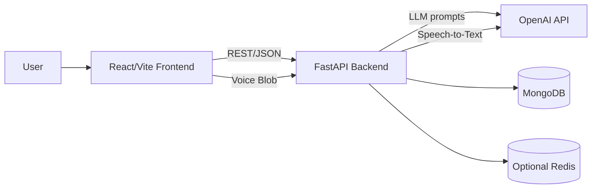

# AI Interviewer Bot - System Design

## 1) Overall Architecture



### Design goals
- **Modular**: Question generation, evaluation, and feedback are isolated services.
- **Scalable**: Stateless API services; database-backed sessions; can horizontally scale.
- **Observable**: Structured logging + clear error envelopes.
- **Extensible**: Add adaptive questioning, resume parsing, multi-language strategy.

## 2) Interview Flow
1. User selects role, difficulty, mode.
2. Frontend calls `POST /api/v1/interviews`.
3. Backend creates interview session and first AI-generated question.
4. User answers via text or voice.
5. Backend evaluates answer (`score`, strengths, weaknesses, suggestions).
6. Backend returns per-question feedback immediately.
7. Repeat until question limit.
8. Backend computes final report and stores analytics.

## 3) Folder Structure

```txt
.
├── backend
│   ├── app
│   │   ├── api
│   │   │   ├── deps.py
│   │   │   └── routes.py
│   │   ├── core
│   │   │   ├── config.py
│   │   │   └── prompts.py
│   │   ├── db
│   │   │   └── mongo.py
│   │   ├── models
│   │   │   └── interview.py
│   │   ├── schemas
│   │   │   └── interview.py
│   │   ├── services
│   │   │   ├── feedback_service.py
│   │   │   ├── llm_client.py
│   │   │   ├── question_service.py
│   │   │   ├── report_service.py
│   │   │   ├── scoring_service.py
│   │   │   └── speech_service.py
│   │   ├── utils
│   │   │   └── text_utils.py
│   │   └── main.py
│   ├── requirements.txt
│   └── README.md
├── frontend
│   ├── src
│   │   ├── api/client.ts
│   │   ├── components
│   │   │   ├── FeedbackCard.tsx
│   │   │   ├── InterviewSetupForm.tsx
│   │   │   ├── ProgressHeader.tsx
│   │   │   └── QuestionCard.tsx
│   │   ├── hooks/useInterview.ts
│   │   ├── pages/InterviewPage.tsx
│   │   ├── types/interview.ts
│   │   ├── App.tsx
│   │   └── main.tsx
│   ├── package.json
│   └── README.md
└── docs/architecture.md
```

## 4) API Endpoints
- `POST /api/v1/interviews` — Start a new interview.
- `GET /api/v1/interviews/{interview_id}` — Fetch interview state.
- `POST /api/v1/interviews/{interview_id}/answer` — Submit text answer.
- `POST /api/v1/interviews/{interview_id}/answer/voice` — Submit voice answer (audio file).
- `GET /api/v1/interviews/{interview_id}/report` — Final report.
- `GET /health` — Health check.

## 5) AI Evaluation Logic
- Build ideal-answer and rubric using role + difficulty + question context.
- Compute deterministic signals:
  - Keyword relevance
  - Concept coverage
  - Brevity/clarity heuristics
- Ask LLM for qualitative analysis.
- Blend weighted score to 0–10.

**Example score formula**:
- `final = 0.5 * llm_score + 0.3 * coverage_score + 0.2 * clarity_score`

## 6) Advanced Extensions
- Adaptive questioning: choose next topic based on weakness tags.
- Resume-based mode: parse resume into skill graph, then generate targeted questions.
- Analytics dashboard: trends by topic, role, session, and confidence.
- Multi-language: prompt with locale + STT/TTS language tags.

## 7) Deployment (high-level)
- Backend: Dockerized FastAPI on Render/Fly/AWS ECS.
- Frontend: Vercel/Netlify static deployment.
- MongoDB Atlas for database.
- Secrets in deployment provider vault.
